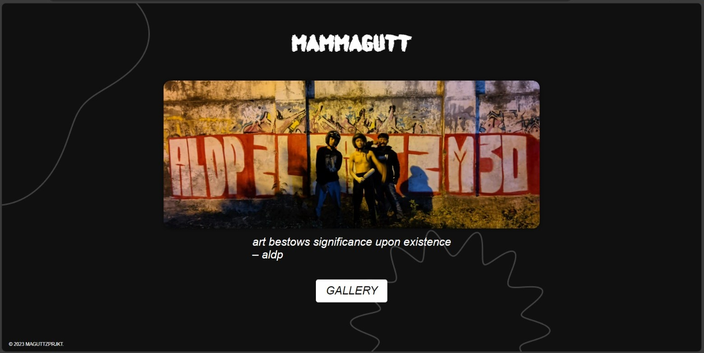

### MaGuttz! Website

This repository contains the source code for the MaGuttz! website. The website is designed to showcase artwork and provide information about MaGuttzprjkt.



#### Features

- Responsive design for various screen sizes (i hope).
- Artwork display with a stylish frame.
- Quote section with an italicized style.
- Gallery button to navigate to the art gallery (under maintenance).

#### Technologies Used

- HTML
- CSS
- JavaScript

#### Setup

1. **Clone the repository:**

   ```bash
   git clone https://github.com/maguttz/vandsite.git
   ```

2. **Open `index.html` in your web browser.**

#### Browser Compatibility

The website is compatible with modern web browsers, including Google Chrome, Mozilla Firefox, and Microsoft Edge.

#### Author

`thejgdt`

Feel free to explore the code, contribute, and use it as a template for your own projects. If you encounter any issues or have suggestions for improvement, please create an issue or submit a pull request.

Thank you for visiting the MaGuttz! website repository!